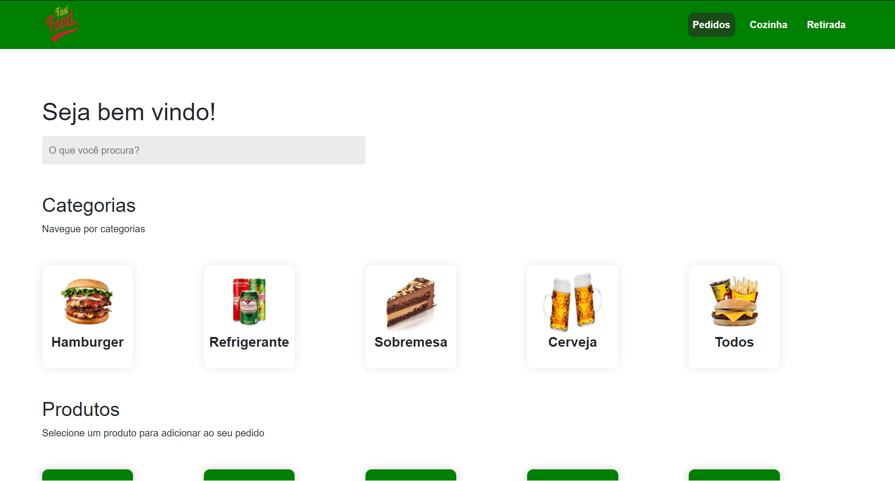

<div align="center" style="margin-bottom: 20px;">

</div>

<div align="center" style="margin: 20px;">
    <p align="center" >
      <a href="#fire-prévia-da-aplicação"> :fire: Prévia da Aplicação</a> |
      <a href="#rocket-tecnologias-usadas"> :rocket: Tecnologias Usadas</a> |
      <a href="#zap-executando-o-projeto"> :zap: Executando o Projeto </a> |
      <a href="#open_book-código"> :open_book: Código </a> |
      <a href="#grinning-conclusão"> :grinning: Conclusão </a> |
      <a href="#phone-contatos"> :phone: Contatos </a>
    </p>
</div>

## :barber: O projeto

O Orkoke FastFood é o resultado do desáfio proposto pela Devio de criar uma aplicação onde é possível pesquisar, comprar e acompanhar pedidos feitos no site.

## :fire: Prévia da Aplicação

https://orlokefood.vercel.app

## :rocket: Tecnologias Usadas

O projeto foi feito com as seguintes tecnologias:

- [ReactJS](https://pt-br.reactjs.org/)
- [NextJs](https://nextjs.org)
- [Styled-Components](https://styled-components.com/)
- [React-Redux](https://react-redux.js.org)
- [React-Bootstrap](https://react-bootstrap.github.io)

## :zap: Executando o Projeto
#### Clonando o projeto

```sh
$ git clone git@github.com:orloke/devio-test.git
$ cd devio-test
```

#### Iniciando o projeto

```sh
$ npm install
$ npm run dev
```

## :grinning: Conclusão

#### Dificuldades

Quando comecei o projeto, não conhecia algumas das ferramentas usadas, como o [Leaflet](https://react-leaflet.js.org) e tinha uma experiência irrisória em outras, como o [React-Redux](https://react-redux.js.org), mas graças ao bom e velho Google, Youtube, StackOverflow e documentações, consegui aprender e aplicar no código. Uma vez superado o desconhecido, as ideias fluiram mais naturalmente apesar de surgir outros problemas. Realmente quebrei a cabeça para criar algumas das funções usadas, e investi algumas horas do meu tempo para desenvolver a parte dinâmica do site: alteração dos icones dependendo do equipamento, alteração das informações ao clicar no mapa e o filtro de maquinas. Esse último saiu já no final do projeto e por ironia a solução é bem simples, talvez não a mais elegante, mas é simples!

#### Pontos de melhorias

* Por mais que tenha me esforçado ainda não acredito que o código esteja o mais 'clean' possível, em algumas partes sinto que poderia ter escrito de outra forma, já outas podem estar redundantes ou repetitivas. 
* Não realizei todos os teste na aplicação, ainda estou aprendendo como fazer, mas creio que no próximo projeto já será possível.
* A tabela de informação de dias pode ficar melhor na versão mobile, com as linhas se transformando em colunas.
* Colocar modo escuro na pagina. Caso o usuário deseje é só clicar em um botão e o background fica preto.
* Ativar a opção de usar localização atual no mapa.


A maior parte dessas melhorias podem ser executadas com mais algumas linhas de código. Além desses há outros pontos de melhorias, que irei superar através dos estudos e disciplina. Abaixo deixo meus contatos para feedbacks e opiniões :grin:!

## :phone: Contatos

Email: [juniordering@hotmail.com](juniordering@hotmail.com)

WhatsApp [(65) 98175-1036](https://wa.me/5565981751036)


